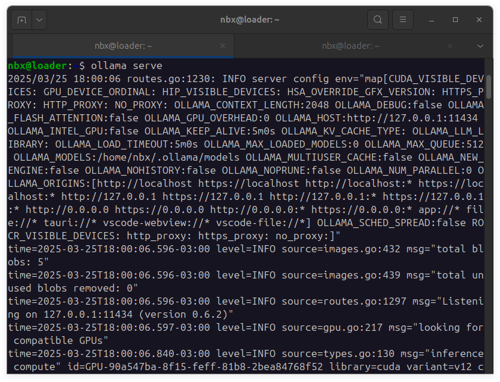

# Chat DeepSeek 6.7B

Este repositório contém um aplicativo web simples que permite interagir com o modelo **DeepSeek 6.7B** através de uma interface de chat. O aplicativo utiliza **Flask** no backend e HTML/JavaScript no frontend para criar uma experiência de chat local.

## Hardware

  

- **GPU**: NVIDIA GeForce RTX 3060 12GB with CUDA

## Tecnologias Utilizadas

   

- **Backend**: Flask (Python)
- **Frontend**: HTML, CSS, JavaScript
- **Modelo de IA**: DeepSeek 6.7B - Coder (via API local)

## Como Utilizar

Siga os passos abaixo para configurar e executar o aplicativo:

### Pré-requisitos

1. **Python 3.12** ou superior instalado.NVIDIA GeForce RTX 3060
2. **Virtualenv** para criar um ambiente virtual Python.
3. O modelo **DeepSeek 6.7B** deve estar configurado e acessível, consulte como preparar seu sistema operacional para receber uma LLM em https://github.com/92username/ia_local_install
4. **GPU NVIDIA RTX 3060** ou superior, com **CUDA**.

### Passo a Passo

1. **Clone o repositório**:
   ```bash
   git clone https://github.com/92username/chat_deepseek_6.7b
   cd chat_deepseek_6.7b
   ```

2. **Crie e ative o ambiente virtual**:
   ```bash
   python3 -m venv deepseek
   source deepseek/bin/activate  # Linux/Mac
   ```

3. **Ative e rode o modelo LLM**:
   Certifique-se de que o modelo **DeepSeek 6.7B - Coder** está configurado corretamente. Para iniciar o servidor do modelo, utilize o comando abaixo em um terminal separado:

   ```bash
   ollama serve
   ```

   

   Isso iniciará o servidor local para o modelo, permitindo que o aplicativo Flask se conecte a ele.
3.1 **Verifique se a LLM está rodando**:  
   Antes de iniciar o servidor Flask, certifique-se de que o modelo está ativo utilizando o comando abaixo:  

   ```bash
   ollama list
   ```  

   

   Isso exibirá uma lista de modelos disponíveis e seus status.

3.2 **Verifique o endereço do servidor**:  
   Após confirmar que o modelo está ativo, você pode acessar o endereço do servidor nonavegador para verificar se a LLM está rodando:  

      
   http://localhost:11434/
      

   Você verá a mensagem **"Ollama is running"**, indicando que o servidor está funcionando corretamente.

   

4. **Instale as dependências**:

   ```bash
   pip install -r requirements.txt
   ```
   
5. **Inicie o servidor Flask**:
   ```bash
   python app.py
   ```

6. **Acesse o aplicativo**:
   Abra o navegador e vá para `http://localhost:5000`.

   

## Licença

Este projeto está licenciado sob a **GNU General Public License v3.0**. Consulte o arquivo [LICENSE](LICENSE) para mais detalhes.
